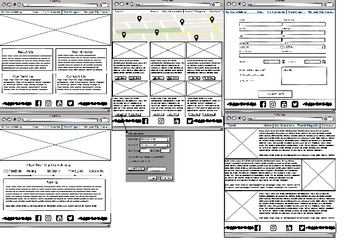
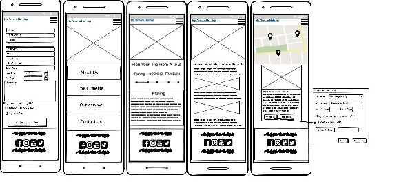

<h1 align="center">My Dream Holiday Website</h1>

*Welcome to my project!* [View the live project here.](https://nahed2019.github.io/My-Dream-Holiday/.)

## About

This is the main marketing website for My Dream Holiday. It is designed to be responsibe and accessible on a range of devices, making it easy to navigate for potential travel lover.

## User Experience (UX)

This projects was created across  5 activity planes :

1. The strategy plan: What do we aim to achieve in the first place and to whom?
    
2. The scope plane: What features, based on information from the strategy plane, what do we want to include in our design?
    
3. The structure plane: How is the information structured and how is it logically grouped?
   
4. The skeleton plane: How will our information be represented, and how will the user navigate to the information and the features?
    
5.  the surface plane: What will the finished product look like? What colors, typography, and design elements will we use?

-   ### User stories

    -   #### First Time Visitor Goals

        1. As a First Time Visitor, I want to easily understand the main purpose of the site and learn more about my Dream Holiday website.
        2. As a First Time Visitor, I want to be able to easily navigate throughout the site to find content.
        3. As a First Time Visitor, I want to look for best places and destinations to visit across the world.

    -   #### Returning Visitor Goals

        1. As a Returning Visitor, I want to find information about new places and destinations
        2. As a Returning Visitor, I want to find best deals and packages for my dream trip.
        3. As a Returning Visitor, I want to find community links.
        4. As a Returning Visitor, I want to find the best way to get in contact with Dream Holiday with any questions I may have.

    -   #### Frequent User Goals

        1. As a Frequent User, I want to see if there are any newly added places or destinations.
        2. As a Frequent User, I want to check to see if there are any newly deals or packages.

-   ### Design

    -   #### Colour Scheme
        -   The main colors used are  White,Black, Pink and Different Gray degrees.

    -   #### Typography
        -   The EXO 2, Lobster, and Cavita fonts are the main fonts used throughout the whole website with Sans Serif as the fallback font in case for any reason the font is not being imported into the site correctly. EXO 2, Lobster, and Cavita are attractive and appropriate.
    
    -   #### Imagery
        -   Imagery is important. The large, background hero image is designed to be striking and catch the user's attention. It also has a modern, energetic aesthetic.

*   ### Wireframes

    1. All Wireframes are created by using Balsamic.
    2. Tablet and Desktop wireframes have the same view. 

    -  Desktop Wireframe -

  
    -  Mobile Wireframe  - 

  
   
    

## Features

-   Responsive on all device sizes

-   Interactive elements

## Technologies Used

### Languages, Frameworks, Libraries & Programs Used

 * The project uses **HTML , CSS and Javascript** 

   -  HTMS: The project uses HTML as a coding language to build the site.[HTML5](https://en.wikipedia.org/wiki/HTML5)

    - CSS:  The project uses CSS to do Styling of the site. [CSS3](https://en.wikipedia.org/wiki/Cascading_Style_Sheets)

    - Javascript: The project uses JS to write the function and more in the site.[JS](https://en.wikipedia.org/wiki/JS)

    - JQuery : JQuery was used for the smooth scroll function in JavaScript.
            
            [https://cdnjs.cloudflare.com/ajax/libs/jquery/3.5.1/jquery.min.js]

* Bootstrap: Bootstrap to assist with responsiveness and Styling of the site.
            
            [stackpath.bootstrapcdn.com/bootstrap/4.5.2/css/bootstrap.min.css]

* Font Awesome: Font awesome was used to add an icon to the site, I add it from Bootstrap CDN stackpath.
           
            [stackpath.bootstrapcdn.com/font-awesome/4.7.0/css/font-awesome.min.css]

* Hover : Hover was used to add hover icones in footer,Button, and cards in the site.
           
            [dnjs.cloudflare.com/ajax/libs/hover.css/2.3.1/css/hover-min.css"]

* Google Fonts Library: Google Font were used to import fonts into the style.css file.
           
            [https://fonts.googleapis.com/css2?family=Caveat:wght@400;700&family=Exo+2:ital,wght@1,300;1,500&family=Lobster&family=Open+Sans:wght@100;200;300;400;500;600;700;800&display=swap]
      
* Git: Git was used to add and commit the files and push it to GitHub.

* GitHub: GitHub was used to store the project.

* Balsamic: Balsamic was used to create the Wireframes.

## Testing

The W3C Markup Validator and W3C CSS Validator Services were used to validate every page of the project to ensure there were no syntax errors in the project.
 
 The result of CSS : Congratulations! No Error Found.

-   [W3C CSS Validator](https://jigsaw.w3.org/css-validator/#validate_by_input)

 The result of HTML : Document checking completed. No errors or warnings to show.

-   [W3C Markup Validator](https://validator.w3.org/) 

My JavaScript code passes through a linter (jshint.com) with no major issues.[jshint.com](https://jshint.com/)
 

### Testing User Stories from User Experience (UX) Section

-   #### First Time Visitor Goals

    1. As a First Time Visitor, I want to easily understand the main purpose of the site and learn more about my Dream Holiday.

        1. Upon entering the site, users are automatically greeted with a clean and easily readable navigation bar to go to the page of their choice. Underneath there is a Hero Image with Text and a underneath of it there is the main content of each page.
        2. The main contents are made immediately underneath the hero image.
        3. The user can scroll down in each page to know more about the content of the site.

    2. As a First Time Visitor, I want to be able to easily navigate throughout the site to find content.
        1. The site has been designed to be fluid and never to entrap the user. At the top of each page there is a clean navigation bar, each link describes what the page they will end up at clearly.
        2. On the Contact Us Page, after a form response is submitted, the page refreshes and the form will get cleared again.

    3. As a First Time Visitor, I want to look for best places and destinations to visit across the world.
        1. Once the new visitor has read the About Us and Our Service, user will know the services and the available offers and packages.
        2. The user can also scroll to the bottom of any page on the site to locate social media links in the footer.

-   #### Returning Visitor Goals

    1. As a Returning Visitor, I want to find information about new places and destinations
        1. These are clearly shown in the banner message.(in these days the message related to Corona Virus)
        2. TUser can go directly to the Travel Magazine page where he can find information about different touristic places.

    2. As a Returning Visitor, I want to find the best deals and packages for my dram trip.
        1. These are clearly shown in the banner message.(in these days the message related to Corona Virus).
        2. The user can go directly to the Destinations page where all destinations and packages will be available.
        3. Whichever link they click, it will be open up in a new tab to ensure the user can easily get back to the website.

    3. As a Returning Visitor, I want to find the best way to get in contact with Dream Holiday with any questions I may have.
        1. The user can go directly to Contact Us page through the navigation bar where he can fill a form with the requested details, and it’ll trigger an email to Dream Holiday.
        2. Alternatively, user can scroll down to the bottom of each page at the footer where he will find the direct email address of Dream Holiday.
        3. If the user is on the "Plan your trip" page they will also be greeted with a Tips and usefull links for a good trip.

-   #### Frequent User Goals

    1. As a Frequent User, I want to see if there are any newly added places or destinations.

        1. The user would already be comfortable with the website layout and can easily click the banner message.
        2. User can go directly to the Travel Magazine page where all places  will be available.
        3. The user can go directly to Contact Us page through the navigation bar where he can fill a form with the requested details, and it’ll trigger an email to Dream Holiday.
        4. Alternatively, user can scroll down to the bottom of each page at the footer where he will find the direct email address of Dream Holiday.
   
    2. As a Frequent User, I want to check to see if there are any newly deals or packages.

        1. The user would already be comfortable with the website layout and can easily click the banner message.
        2. User can go directly to the Destinations page where all destinations and packages will be available.
        3.The user can go directly to Contact Us page through the navigation bar where he can fill a form with the requested details, and it’ll trigger an email to Dream Holiday.
        4. Alternatively, user can scroll down to the bottom of each page at the footer where he will find the direct email address of Dream Holiday.
    
### Further Testing

-   The Website was tested on Google Chrome, Internet Explorer, Microsoft Edge and Safari browsers.
-   The website was viewed on a variety of devices such as Desktop, Laptop,IPad, Samsung Note, Samsung S10, Android 6.0Samsung Galaxy S7,Android 4.4 & 6 Google Nexus 5 (Portrait), iPhone7, iPhone 8 plus & iPhoneX.
-   A large amount of testing was done to ensure that all pages were linking correctly.
-   Friends and family members were asked to review the site and documentation to point out any bugs or user experience issues.

### Known Bugs

-   In Windows 8.1Firefox 30 and Windows 7IE 8 the navbar showing as alist not inline.
-   The contact form  is fine in most browsers, But it is not working properly in win10 - ie- 11.0 , it shifted to the right.

## Deployment

### Gitpod Reminders

To run a frontend (HTML, CSS) application in Gitpod, in the terminal, type:

`python3 -m http.server`

A blue button should appear to click: *Make Public*,

Another blue button should appear to click: *Open Browser*.

### GitHub Page

The project was deployed to GitHub Pages using the following steps...

1. Log in to GitHub and locate the [GitHub Repository](https://github.com/)
2. At the top of the Repository (not top of page), locate the "Settings" Button on the menu.
3. Scroll down the Settings page until you locate the "GitHub Pages" Section.
4. Under "Source", click the dropdown called "None" and select "Master Branch".
5. The page will automatically refresh.
6. Scroll back down through the page to locate the now published site [link](https://github.com) in the "GitHub Pages" section.

### Forking the GitHub Repository

By forking the GitHub Repository we make a copy of the original repository on our GitHub account to view and/or make changes without affecting the original repository by using the following steps...

1. Log in to GitHub and locate the [GitHub Repository](https://github.com/)
2. At the top of the Repository (not top of page) just above the "Settings" Button on the menu, locate the "Fork" Button.
3. You should now have a copy of the original repository in your GitHub account.

### Making a Local Clone

1. Log in to GitHub and locate the [GitHub Repository](https://github.com/)
2. Under the repository name, click "Clone or download".
3. To clone the repository using HTTPS, under "Clone with HTTPS", copy the link.
4. Open Git Bash
5. Change the current working directory to the location where you want the cloned directory to be made.
6. Type `git clone`, and then paste the URL you copied in Step 3.

$ git clone https://github.com/YOUR-USERNAME/YOUR-REPOSITORY

7. Press Enter. Your local clone will be created.

$ git clone https://github.com/YOUR-USERNAME/YOUR-REPOSITORY

Click [Here](https://help.github.com/en/github/creating-cloning-and-archiving-repositories/cloning-a-repository#cloning-a-repository-to-github-desktop) to retrieve pictures for some of the buttons and more detailed explanations of the above process.

## Credits

### Content

- All Content was written by developer.

### Media

- All Images were downloaded from Google.com
- Most of the Texts and Paragraphs from Wikipedia with some changes done by the developer

### Acknowledgements

- I received inspiration for some points in this project from YouTube videos Java Script coding.
  it helped me get some ideas and implement the same while building the site such as:
    * https://www.youtube.com/watch?v=oXLha6A4gjc&t=206s
    * https://javascript30.com/
    - ( I reused some code and  adjusted it as my project needs)

## Thank you

- I would like to express my gratitude to the great efforts done by my Memtor.
- Thanks for the Tutors which helped me in completing this level. All the classes and lessons were very valuable and had a great added value to my knowledge and future career.
- Thanks for all Student Care Advisers which supported the Students.
- Thanks for Slack Community for their support.
- Looking forward for the next project.
